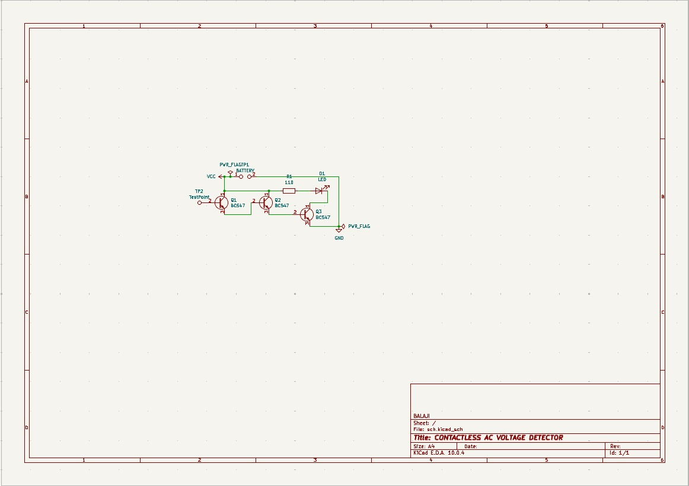
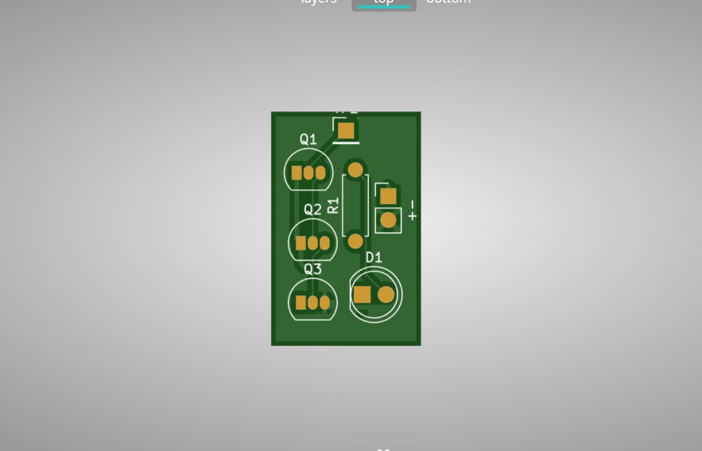
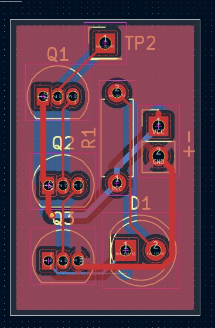
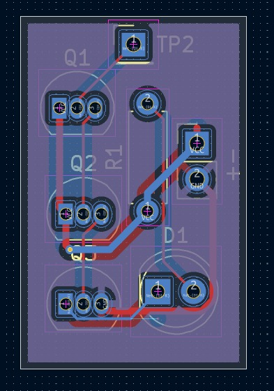
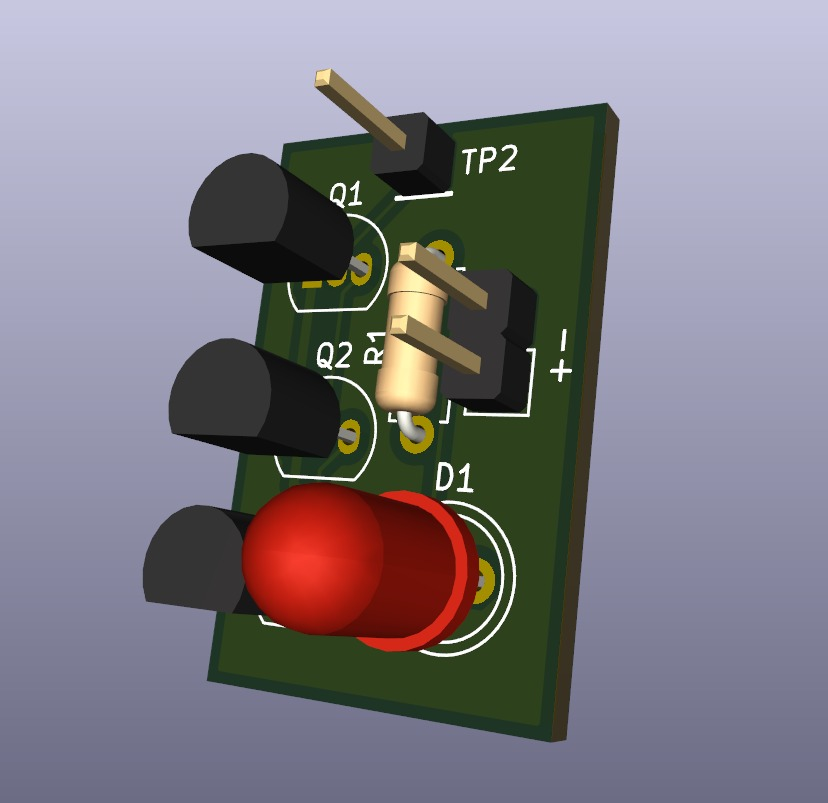

# Voltsense – Contactless AC Voltage Detection PCB

## Overview

Voltsense is a custom PCB designed for a contactless AC voltage detection system. The board integrates the sensing circuit, signal conditioning, indicator LEDs, buzzer interface, and power supply into a compact and reliable design suitable for embedded and electrical applications.

---

## Features

- Contactless AC voltage detection
- Compact 2-layer PCB design
- LED indication
- Buzzer output
- Optimized component placement
- Clean PCB routing
- Design Rule Check (DRC) verified
- Manufacturing-ready Gerber generation

---

## Tools Used

- Autodesk Fusion 360 Electronics
- PCB Layout Editor
- Design Rule Check (DRC)
- Gerber File Generation

---

## Design Specifications

| Parameter | Value |
|-----------|-------|
| Board Type | 2-Layer PCB |
| Application | Contactless AC Voltage Detection |
| Design Software | Autodesk Fusion 360 |
| Status | Completed |

---

# Project Images

## Schematic Diagram

---

## PCB Render

---

## Top View

---

## Bottom View

---

## 3D View

---

## Design Process

- Circuit schematic design
- Component selection
- PCB footprint assignment
- Component placement
- PCB routing
- Design Rule Check (DRC)
- 3D verification
- Gerber file generation

---

## Skills Demonstrated

- PCB Design
- Schematic Capture
- PCB Routing
- Electronic Hardware Design
- DRC Verification
- Gerber Generation
- Embedded Hardware Development

---

## Future Improvements

- EMI/EMC optimization
- PCB miniaturization
- Reverse polarity protection
- Over-voltage protection
- Hardware testing and validation

---

## Author

**Balaji M**

Electrical and Electronics Engineering

Interested in Embedded Systems, PCB Design, IoT, Smart Grid, and Hardware Product Development.
